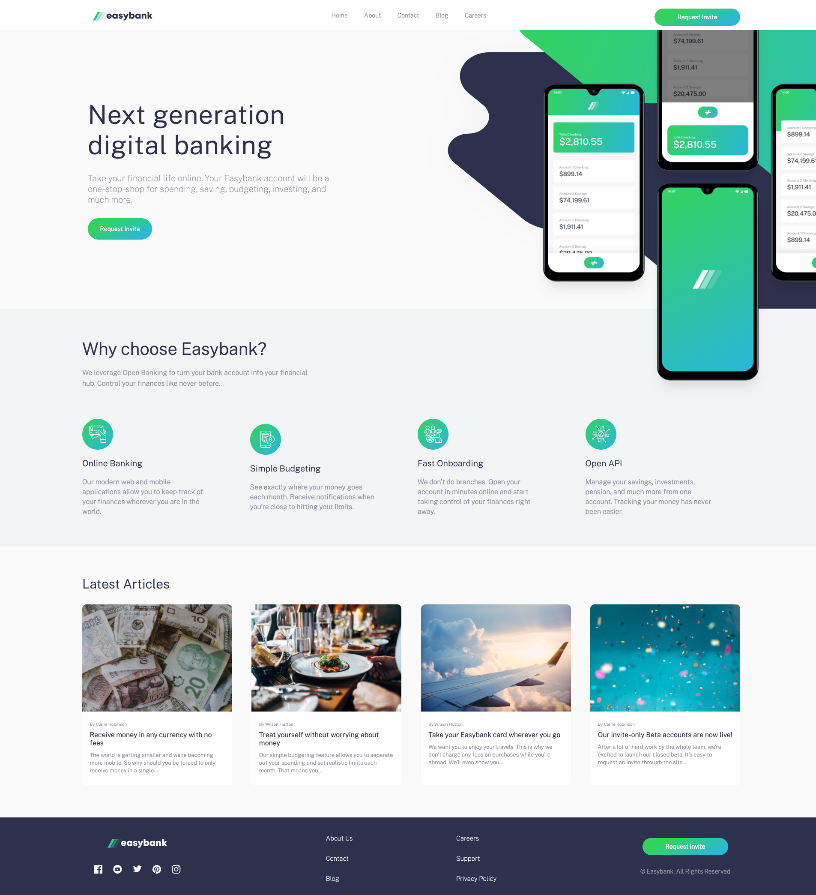
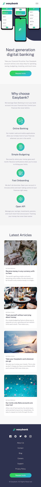

    

<h1 id="easybank">💳 Easybank Theme Landing Page </h1>

This is a landing page created with [Frontend Mentor resources](https://www.frontendmentor.io/challenges/easybank-landing-page-WaUhkoDN). The landing page has different sections, these sections was made with Flexbox and CSS Grid, also it has a desktop and mobile version.
As an additional feature I created and responsive hamburger menu with animations.

You can see it here → [Easybank Landing Page](https://easybank-landing-page-tau-umber.vercel.app/#).

## Table of contents

- [Easybank Landing Page](#easybank)
- [Available Scripts](#scripts)
- [Preview](#preview)
  - [Desktop](#desktop)
  - [Mobile](#mobile)
- [Technologies](#technologies)
- [Author](#author)

<h2 id="scripts">🔥 Available Scripts</h2>
Not dependencies are required for this project.

<h2 id="preview">🔍 Preview</h2>

  
🖥 Desktop version
    
  

  
📱 Mobile version
  
  

<h2 id="technologies">📌 Technologies</h2>

1. Semantic HTML
2. Vanilla CSS
3. Animations
4. Transitions
5. Javascript

<h2 id="author">🌟 Author</h2>

**Alejandra Camacho** - [@alexcamachogz](https://github.com/alexcamachogz)

> This is a FrontendMentor project.
